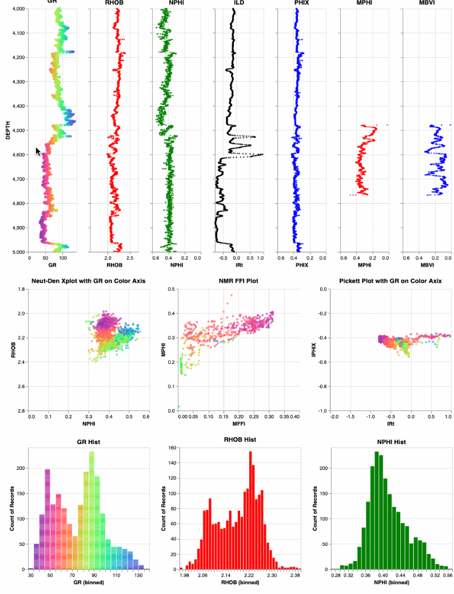

# Interrogate Petrophysical log data using Python's Interactive Altair
The objective of this project is to interrogate Petrophysical log data using python's interactive Altair. 

The following are some example results using Altair with log data where the data in depth plots, cross plots or histograms can be selected and then the appropriate data for those selected samples are shown in the other plots. 

We are still on the learning curve with Altair and have more to come. 

We have also added a jupyter notebook that will read a las file (called GulfCoast.las in this instance). We are using lasio to read the las file. Lasio can also write a pandas DataFrame, but the depth plots will not recognize the data in this format. Therefore, for a workaround for now, we are writing the las data to a csv file. We then read in this csv file and the pandas DataFrame is correct and Altair works properly. We will de-bug this. We want this to be one step from reading in the las file to creating the pandas DataFrame. 

